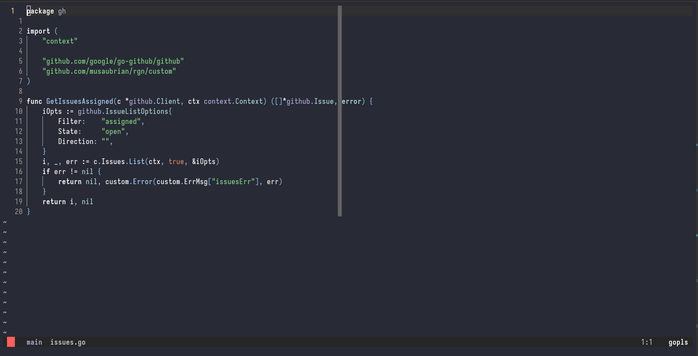
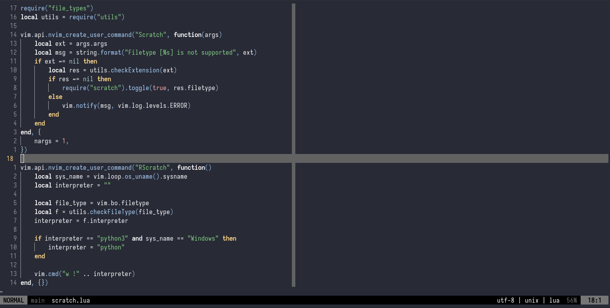

# JADE.NVIM

Yet another colorscheme.
Built using [colorbuddy](https://github.com/tjdevries/colorbuddy.nvim)
and took some inspiration from [catcusbuddy](https://github.com/redbug312/cactusbuddy).

It does not apply styles to the status bar

## Usage
1. Packer

```lua
use = {"musaubrian/jade.nvim", requires = "tjdevries/colorbuddy.nvim"}

require('colorbuddy').colorscheme('cactusbuddy')
```

2. Lazy
```lua

```

### Screenshots
- **Golang**

- **Lua**



