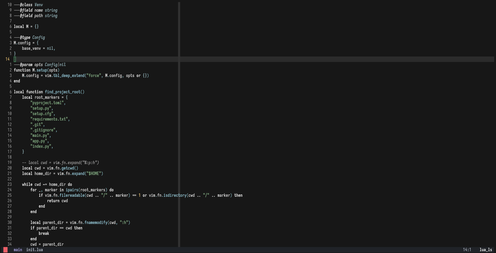

> [!NOTE]
> May no longer maintain this as its integrated in my config
> using the inbuilt `vim.api.nvim_set_hl(...)`

# jade.nvim

Yet another colorscheme.
Built using [colorbuddy](https://github.com/tjdevries/colorbuddy.nvim)
and took some inspiration from [catcusbuddy](https://github.com/redbug312/cactusbuddy).

## Usage
1. Packer

```lua

use = {"musaubrian/jade.nvim", requires = "tjdevries/colorbuddy.nvim"}
require("jade").setup({})
```

2. Lazy

```lua
  {
    'musaubrian/jade.nvim',
    dependencies = "tjdevries/colorbuddy.nvim",
    lazy=false,
    opts = { }
  },
```

### Screenshots
- **Golang**

- **Lua**



